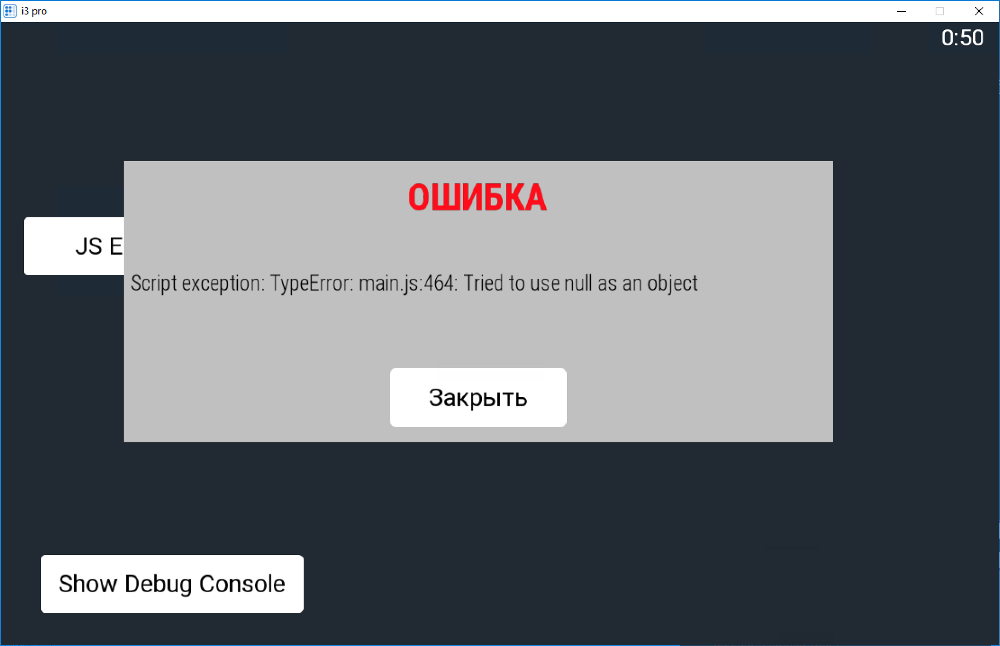
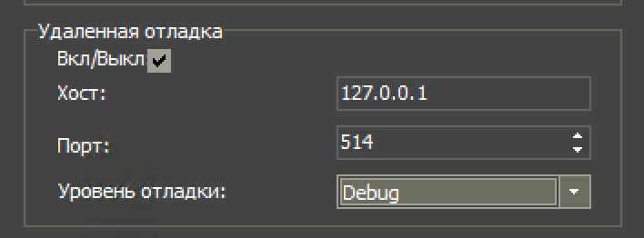

# SyslogServer для проектов в iRidium mobile

Модуль предназначен для "перехвата" сообщений, которые выводятся в отладочную консоль в проектах [iRidium mobile](http://www.iridi.com).
Модуль может использоваться для организации вывода сообщений непосредственно в панельном проекте либо для того
чтобы показать сообщение о необходимости перезапустить проект в случае возникновения нештатной ситуации.



Модуль может использоваться в любых панельных проектах (irpz). Он также должен работать в серверных проектах (sirpz), но
в серверных проектах он пока не тестировался. Модуль использует драйвер **AV & Custom**.


## Установка и настройка

1. Добавьте модуль в проект
Если используется grunt-скрипт [Irdiium Project Builder](https://github.com/bladerunner2020/iridium-project-builder)
для автоматического построения проектов, то для установки модуля нужно использовать команду:

```npm
npm install https://github.com/bladerunner2020/iridium-syslog.git --save
```

В противном случае просто скопируйте код из index.js в ваш irpz-проект.

2. Настройте удаленную отладку в свойствах irpz-проекта.

В свойствах проекта обязательно нужно указать хост: *127.0.0.1* (при необходимости можно сменить порт).
Уровень отладки рекомендуется **INFO** или **DEBUG**.



## Использование

Для использования необходимо создать экземпляр сервера **new SyslogServer(port, name)** (port и name - опциональные параметры)
 и подписаться на события при помощи функции **on(event, callback)**. При получения события **event** вызывается
 **callback** с параметром **{event, message, source, timestamp}**

Типы событий:

- **all** - специальное событие, которое вызывается при получении любых событий
- **info** - событие при использовании **IR.Log** (в качестве источника будет указан **SCRIPT**)
- **warning** - событие при возникновения не отлавливаемого исключения в JS (в качестве источника будет указан **SCRIPT**)
- **debug** - отладочные сообщения iRidium mobile (если установлен соответсвующий уровень отладки), а также сообщения,
которые выводятся в консоль при помощи **IR.Log**, если они начинаются с префикса **"DEBUG: "**.
- **error** - сообщения об ошибках, выдаваемых iRidium mobile, а также сообщения,
 которые выводятся в консоль при помощи **IR.Log**, если они начинаются с префикса **"ERROR: "**.
- другие события, соответсвующие уровням отладки в iRidium mobile


Пример использования **SyslogServer**:

```javascript
new SyslogServer()
    .on('all', function (msg) {
         debugConsole.log(msg); // debugConsole - модуль для вывода сообщений в панельном проекте
    })
    .on('warning', function (msg) {
        IR.GetPopup("MsgBox").GetItem("ErrorText").Text = msg.message;
        IR.ShowPopup("MsgBox");
    });
```

**ВАЖНО:** Не используйте **IR.Log** внутри обработчиков **on('all', callback)** и **on('info', callback)**, так как это
может привести к бесконечному циклу.

## Пример проекта

В папке **test** находится тестовый проект **iridium-syslog.irpz**, который собирается при помощи grunt-скрипта [Irdiium Project Builder](https://github.com/bladerunner2020/iridium-project-builder).
В папке [test/build](https://github.com/bladerunner2020/iridium-syslog/tree/master/test/build) находится уже собранный проект - скачивайте и смотрите как все работает. :smile:

## Ограничения и планы на будущее

При использовании данного модуля вы теряете возможность удаленной отладки, так как отладочная информация "замыкается"
на саму панель.

В будущих версиях планируется добавить возможность пересылать сообщения syslog на указанный ip-адрес.


## Авторы

* Александр Пивоваров aka Bladerunner2020 ([pivovarov@gmail.com](mailto:pivovarov@gmail.com))

## Лицензия
Copyright (c) 2018 Александр Пивоваров

Данная лицензия разрешает лицам, получившим копию данного программного обеспечения и сопутствующей документации (в дальнейшем именуемыми «Программное Обеспечение»), безвозмездно использовать Программное Обеспечение без ограничений, включая неограниченное право на использование, копирование, изменение, слияние, публикацию, распространение, сублицензирование и/или продажу копий Программного Обеспечения, а также лицам, которым предоставляется данное Программное Обеспечение, при соблюдении следующих условий:

Указанное выше уведомление об авторском праве и данные условия должны быть включены во все копии или значимые части данного Программного Обеспечения.

ДАННОЕ ПРОГРАММНОЕ ОБЕСПЕЧЕНИЕ ПРЕДОСТАВЛЯЕТСЯ «КАК ЕСТЬ», БЕЗ КАКИХ-ЛИБО ГАРАНТИЙ, ЯВНО ВЫРАЖЕННЫХ ИЛИ ПОДРАЗУМЕВАЕМЫХ, ВКЛЮЧАЯ ГАРАНТИИ ТОВАРНОЙ ПРИГОДНОСТИ, СООТВЕТСТВИЯ ПО ЕГО КОНКРЕТНОМУ НАЗНАЧЕНИЮ И ОТСУТСТВИЯ НАРУШЕНИЙ, НО НЕ ОГРАНИЧИВАЯСЬ ИМИ. НИ В КАКОМ СЛУЧАЕ АВТОРЫ ИЛИ ПРАВООБЛАДАТЕЛИ НЕ НЕСУТ ОТВЕТСТВЕННОСТИ ПО КАКИМ-ЛИБО ИСКАМ, ЗА УЩЕРБ ИЛИ ПО ИНЫМ ТРЕБОВАНИЯМ, В ТОМ ЧИСЛЕ, ПРИ ДЕЙСТВИИ КОНТРАКТА, ДЕЛИКТЕ ИЛИ ИНОЙ СИТУАЦИИ, ВОЗНИКШИМ ИЗ-ЗА ИСПОЛЬЗОВАНИЯ ПРОГРАММНОГО ОБЕСПЕЧЕНИЯ ИЛИ ИНЫХ ДЕЙСТВИЙ С ПРОГРАММНЫМ ОБЕСПЕЧЕНИЕМ.
